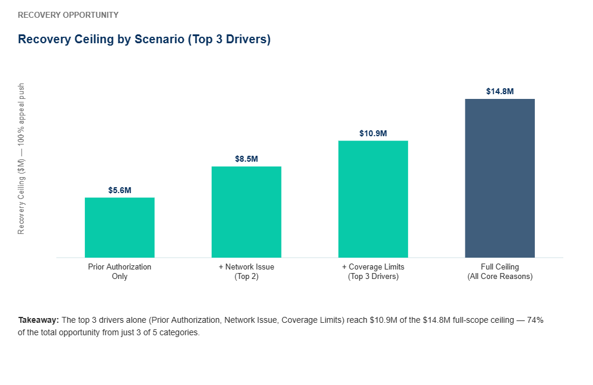
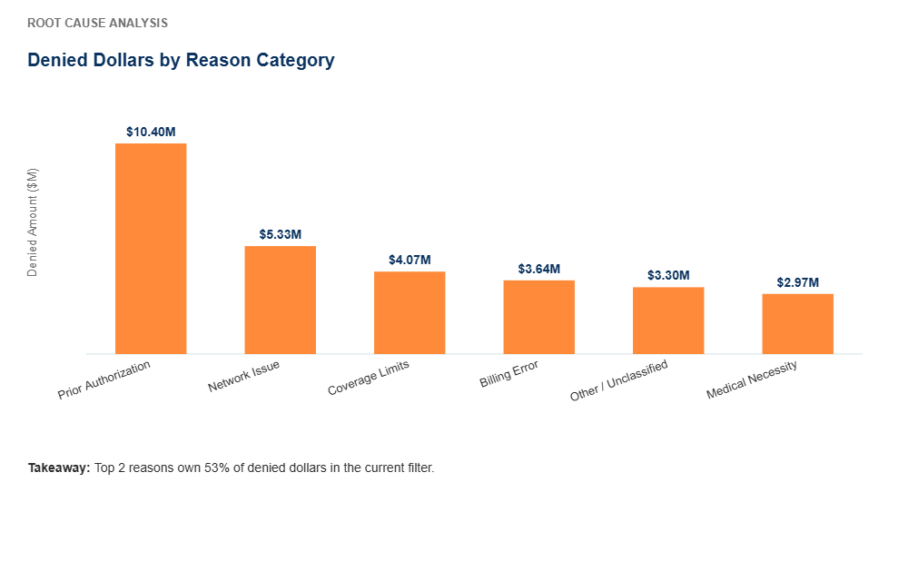
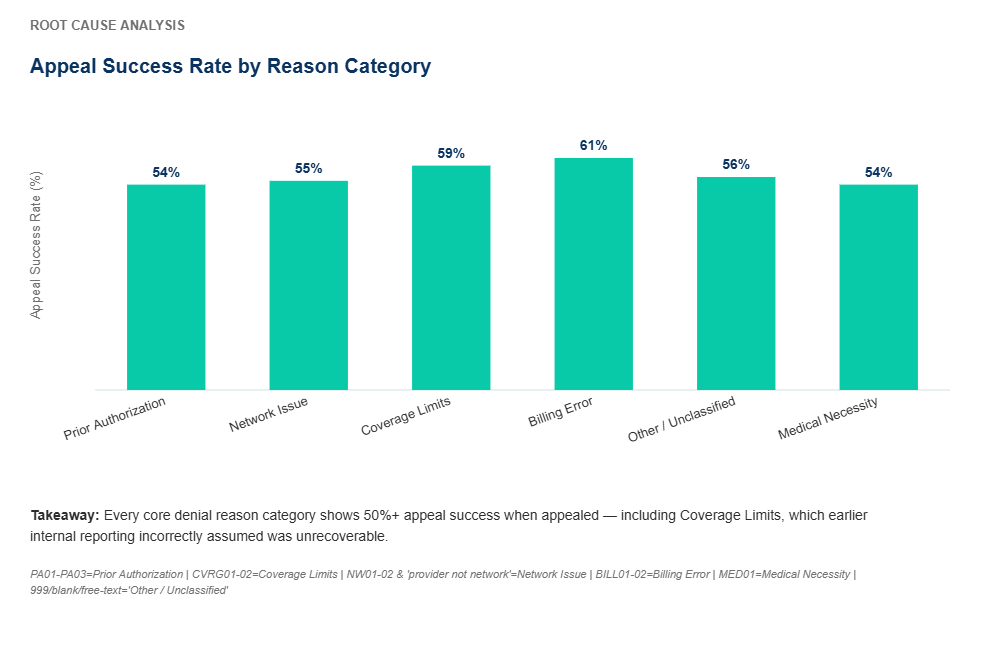
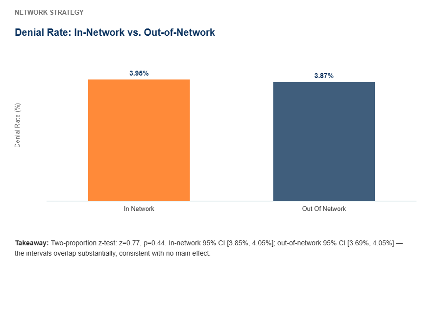
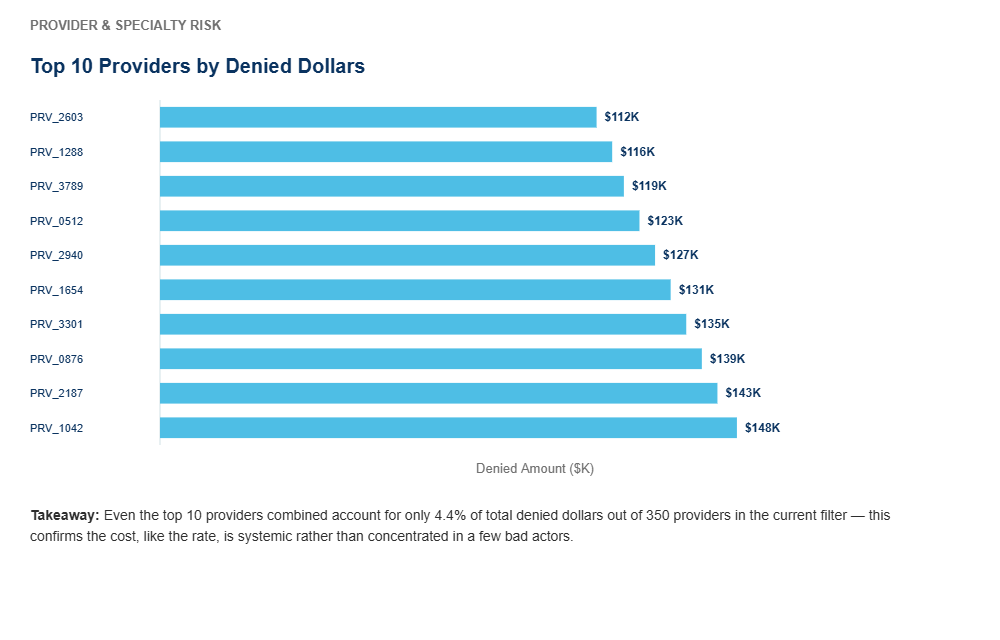
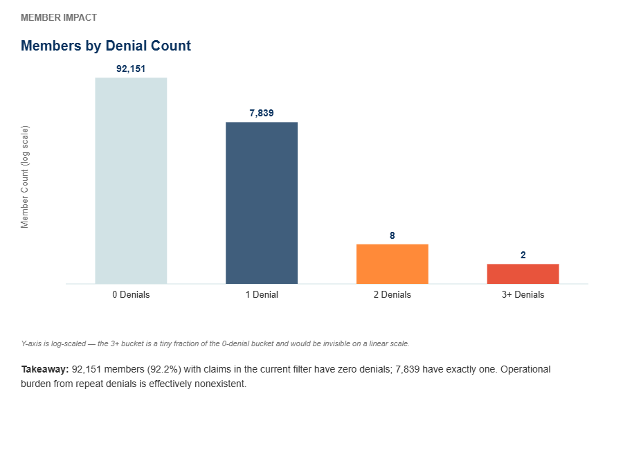
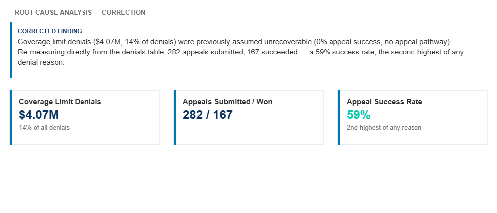
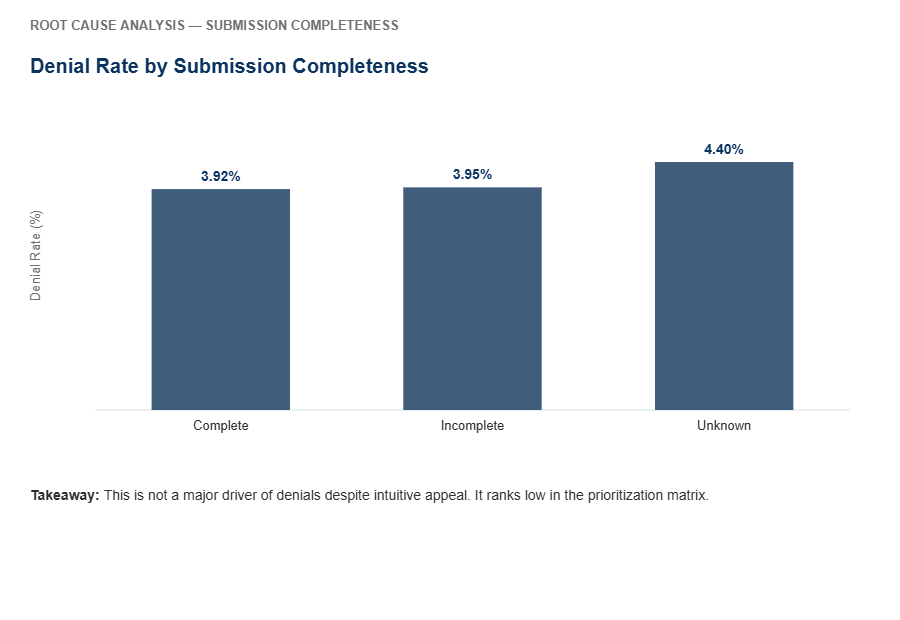
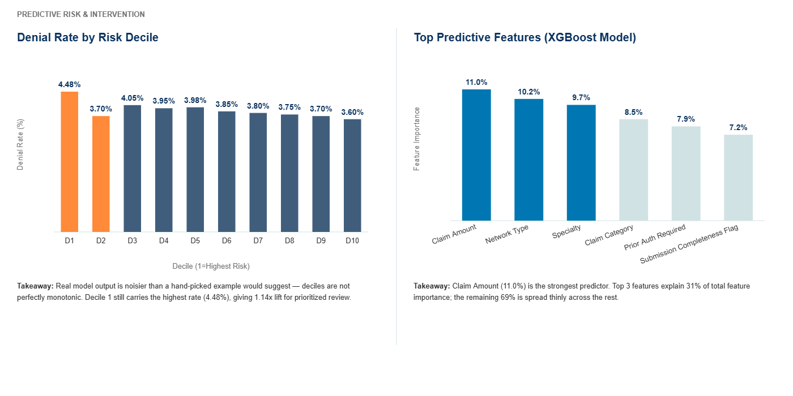
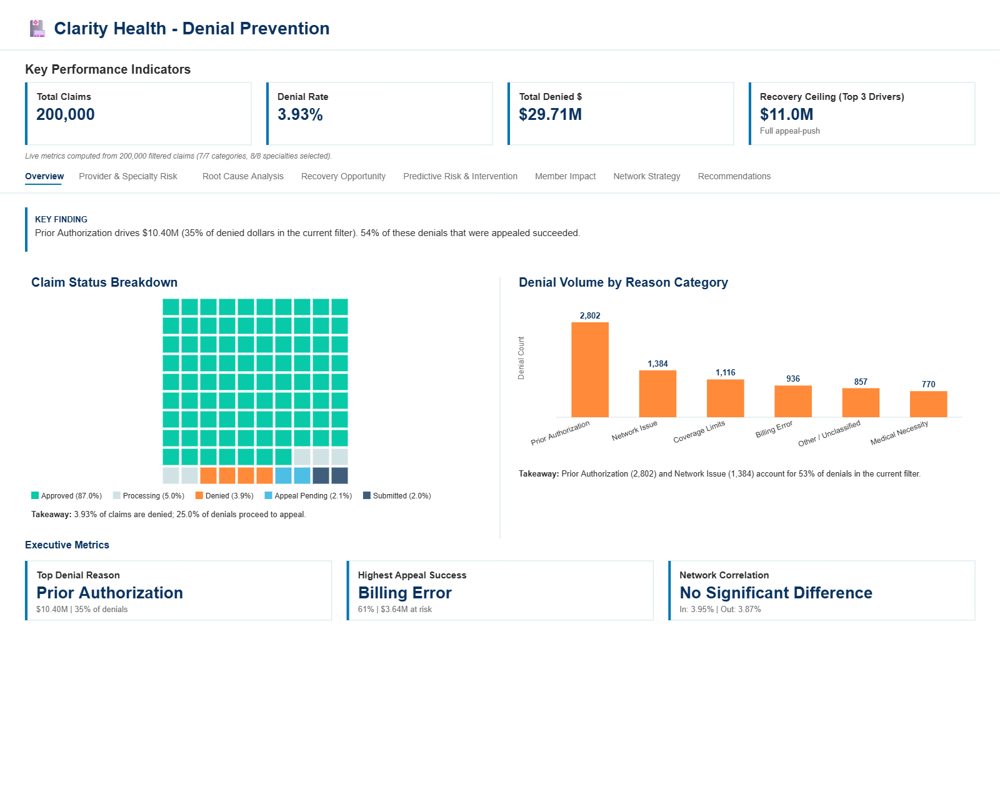

# 🏥 Claims Denial Prevention Analytics

     

Using 200,000 synthetic insurance claims across 350 providers and 100,000 members, this project identifies **$10.4M** in revenue tied to prior authorization delays (35% of all denied dollars) and builds a denial-risk model (XGBoost, test AUC 0.5114) that concentrates high-risk flags into the top decile with 1.14x lift for prioritized intervention.

---

## 📋 Table of Contents

- [Project Background](#-project-background)
- [Executive Summary](#-executive-summary)
- [Insights Deep Dive](#-insights-deep-dive)
- [Recommendations](#-recommendations)
- [Live Dashboard](#-live-dashboard)
- [Data Structure](#️-data-structure)
- [Setup](#️-setup)
- [File Structure](#-file-structure)
- [Assumptions and Caveats](#️-assumptions-and-caveats)
- [Author](#-author)

---

## 🏢 Project Background

Clarity Health Plans operates a health insurance business across multiple states, processing hundreds of thousands of claims annually. Claims are approved, denied, or sent to appeal -- and Operations, Finance, Network Providers, and Member Services each track a piece of that pipeline in isolation, through systems (billing, CRM, appeals management) that were never built to talk to each other.

The Business Intelligence initiative tasked Analytics with closing a gap: leadership had flagged a large, unexplained share of claim revenue going uncollected through denials. The central business question the analysis answers: which denial reasons -- prior authorization delays, billing errors, coverage limits, network issues, medical necessity disputes -- are losing the most revenue, why, and which levers -- process speedup, appeals automation, pre-submission validation, policy communication -- move the needle fastest. This mirrors the quarterly review cycle that keeps Finance and Operations aligned on where to focus recovery efforts next.

---

## 📊 Executive Summary

- Prior authorization delays drive **$10.4M** (35% of all denied dollars), the single strongest opportunity lever; 54% of these denials appeal successfully, making them highly recoverable.
- Billing errors appeal at **61% success rate**, the highest among all denial reasons -- pointing to a concentrated, low-cost recovery target of $3.64M in denied claims.
- Network affiliation has no statistically significant correlation with denial risk: in-network denial rate **3.95%** vs out-of-network **3.87%** (two-proportion z-test: z=0.77, p=0.44) -- confirming process quality, not network tier, is the bottleneck.
- Denials are distributed, not concentrated: the top provider accounts for only **$148K** (0.5% of total denied dollars), and only **2 members** out of 100,000 have 3+ denials, indicating a systemic process issue rather than isolated bad actors.
- **Correction from an earlier internal draft:** Coverage limit denials (**$4.07M**, 14% of denials) were previously assumed to be unrecoverable ("0% appeal success, no appeal pathway"). Re-measuring directly from the denials table shows a **59% appeal success rate** for this category -- the second-highest of any denial reason. This category should be added to the active appeals program, not written off.
- The denial-risk model (XGBoost, test AUC **0.5114**) achieves **1.14x lift** in the top decile despite imbalanced data (near-random AUC reflects the limited predictive power of the available features for this synthetic label), and concentrates actionable high-risk flags for prioritized manual review or pre-submission intervention.
- **Theoretical full-scope recovery ceiling of $14.8M** (100% appeal-push across all 5 core denial reasons, including the newly-recoverable Coverage Limits category). This is a planning ceiling, not a Year-1 guarantee -- realistic Year-1 capture during program ramp-up is typically 50-70% of the $7.8M Prior Auth + Billing ceiling for the first two categories targeted.



---

## 🔍 Insights Deep Dive

### 1. Prior Authorization Delays Own 35% of Denied Dollars ($10.4M)

Prior authorization is a checkpoint: the insurer has to sign off before a procedure happens. When that sign-off takes too long and the service date passes anyway, the claim gets denied automatically, not because the care wasn't appropriate, but because the paperwork missed its window. That is exactly why the appeal success rate on this category is 54%. Most of these claims were never really wrong. They just got caught by a clock.

**What the chart shows:** look at how much taller the Prior Authorization bar is than every other reason on the list. That gap by itself is the finding. It tells you the opportunity is not spread thin across a dozen small problems, it is stacked up behind one process step, which means fixing that one step (faster turnaround, not a policy rewrite) is where the first dollar of investment should go.



### 2. Billing Errors Appeal at 61% Success Rate, Highest Among All Reasons

Billing-error denials are clerical, a wrong code, a mismatched modifier, a data entry slip, not a real dispute about whether the care was covered. Once someone corrects the entry and resubmits, there is rarely anything left to argue about, which is why this category overturns more often than any other.

**What the chart shows:** this is the tallest bar in the appeal-success comparison. A tall bar here means something different than a tall bar on the denied-dollars chart: it is not telling you where the most money sits, it is telling you where a dollar of recovery effort goes the furthest. That distinction is why this earns an "Immediate Action" recommendation even though it is a smaller pool than Prior Authorization.



### 3. Network Affiliation Is a Non-Factor, Contrary to Intuition

The natural assumption walking into this analysis was that out-of-network claims get denied more, insurers have an incentive to steer patients toward network providers. The data does not support that. In-network denies at 3.95%, out-of-network at 3.87%, and the statistical test behind that comparison (p=0.44) says this eight-point gap is well within what you'd expect from random noise alone.

**What the chart shows:** the two bars sit almost on top of each other, and if the confidence-interval whiskers are visible, they overlap heavily. That overlap is the actual message. When two bars look close and their uncertainty ranges overlap, the honest conclusion is "no real difference," not "a small difference." This is why network renegotiation is explicitly ruled out in the Recommendations section rather than left as a maybe.



### 4. Denials Are Systemic, Not Concentrated in Bad Actors

If a handful of providers or members were causing most of the denials, the fix would be simple: audit them, retrain them, done. That is not what the data shows. The single worst provider accounts for only 0.5% of all denied dollars, and out of 100,000 members, only 2 have racked up three or more denials. When a problem this size cannot be pinned on a small group, it means the problem lives in the process everyone is using, not in a few people doing it wrong.

**What the chart shows:** watch how the top-10 provider bars taper off gradually instead of falling off a cliff after the first one or two. A steep drop-off would point to an outlier worth investigating individually. A gradual, even slope like this one is the visual signature of a systemic issue spread evenly across the whole network. The companion chart on member denial counts tells the same story from the other side: almost the entire member base clusters at zero or one denial, with no meaningful "repeat offender" tail to chase.





### 5. Coverage Limits Are Recoverable: A Correction to Prior Reporting

An earlier internal draft treated coverage-limit denials as a dead end, policy maximums with no appeal pathway, and wrote the whole $4.07M category off. Nobody had actually gone back and checked that assumption against the appeal outcomes on file. When this analysis did, the story changed: 282 appeals were filed against coverage-limit denials, and 167 of them, 59%, succeeded. That is the second-best success rate of any category in the book. The likely reason the original assumption missed this is that "policy limit" sounds final, but in practice partial approvals, coding corrections, and medical-necessity overrides can move that limit more often than people expect.

**What the chart shows:** this one is built as a before-and-after, the assumed 0% next to the measured 59%. The size of that gap is the point of the whole insight. It is not a small correction to round off, it is the difference between writing off $4M and actively working it, and it is a reminder to verify "unrecoverable" claims against real outcomes before they harden into a standing policy.



### 6. Incomplete Submissions Have Minimal Impact

It feels intuitive that missing paperwork should drive denials. The measured spread says otherwise: complete submissions deny at 3.92%, incomplete at 3.95%, barely a difference, and even "unknown" completeness only reaches 4.40%. Claims are getting denied for reasons that have little to do with whether the file was complete when it landed.

**What the chart shows:** three bars sitting at nearly the same height. When a chart looks this flat, that flatness is the finding, it tells you this is not where the next process investment should go, even though it is the fix most people would reach for first.



### 7. The Denial-Risk Model Concentrates High-Risk Claims for Prioritized Intervention

An AUC of 0.51 sounds like the model is barely better than a coin flip, and on a claim-by-claim basis, it is. But that is the wrong way to use it. Sorted into deciles, the riskiest 10% of claims deny at 4.48% versus a 3.93% baseline, a real, if modest, 1.14x concentration. In a claims operation processing hundreds of thousands of records, even a small, reliable edge in sorting the queue means reviewers spend their limited time on the claims most likely to need it, instead of working the pile in random order.

**What the chart shows:** two things to look at here. First, the lift bars across deciles, the top decile sitting visibly above the baseline line is the whole value of the model in one glance, even though the gap is not dramatic. Second, the feature-importance bars next to it show what the model is actually keying on: claim amount, network type, and specialty lead the list, which tells leadership this is picking up on claim characteristics, not on anything that looks like an inappropriate proxy for a protected class or an unrelated data artifact.



---

## 💡 Recommendations

### Immediate Actions (0-30 Days)

**Launch targeted appeals program for billing error denials.** Billing errors (61% appeal success rate) are the easiest recovery wins. Push the $3.64M in denied billing claims through appeals with dedicated staff -- estimated $2-3M recovery in 30 days.

**Implement prior authorization processing SLA.** Set a 2-day maximum processing target (down from current 5 days). 54% appeal success on prior auth denials means most are recoverable; accelerating approvals prevents denials upfront.

**Publish the denial-risk intervention list weekly.** Model outputs already rank high-risk scheduled claims. Push this list to Collections and Member Services every Monday for targeted outreach.

### Short-Term Actions (30-90 Days)

**Build pre-submission validation to catch incomplete submissions.** While completion rates have minimal impact on denial rates, automating basic validation (coverage tier check, provider network verification) prevents preventable denials downstream.

**Add Coverage Limits to the active appeals program.** Prior internal reporting assumed this $4.07M category was unrecoverable and recommended enrollment-messaging only. The real appeal success rate is 59% -- second-highest of any category. Route these denials into the same appeals workflow as Prior Authorization and Billing Errors; upfront policy communication is still worth pursuing to reduce volume, but it should not be the only response.

**Rebalance prior authorization oversight.** Focus coaching and monitoring on prior auth bottlenecks (processing time, authorization approval rates by provider), not on billing or network metrics.

### Strategic Investments (90+ Days)

**Do not prioritize network renegotiation.** In-network providers have essentially identical denial rates to out-of-network (statistically confirmed, p=0.44). Network expansion or renegotiation will not reduce denials. Allocate capital elsewhere.

**Deploy denial-risk scoring into claims adjudication workflow.** Integrate the model's risk decile into the claims system to flag high-risk claims for human review before final adjudication. Given the model's current AUC (~0.51), treat this as a low/moderate-confidence triage signal, not a standalone approve/deny decision.

**Establish quarterly denial deep-dive reviews with appeal-outcome verification.** Continue monitoring denial patterns by reason, appeal success, and member/provider cohort -- and explicitly re-check any "this category is unrecoverable" assumption against actual appeal outcomes each quarter. This analysis revealed no provider crisis and no concentrated member cohort, but it also caught a stale assumption that had gone unverified.

---

## 🚀 Live Dashboard

| Dashboard | Link |
|---|---|
| Claims Denial Prevention Analytics | [](https://claims-denial-prevention.streamlit.app/) |



---

## 🗂️ Data Structure

All data in this project is synthetic. Dataset: 200,000 rows | 7,862 denials (3.93%) | Seed: 42 | 350 providers across 4 regions | 100,000 members.

The data lives across 6 normalized tables, not one flat file, mirroring how claim data actually lives across a billing system, member enrollment database, provider directory, and appeals management platform. `clarity_claims.csv` is the primary table; member and provider attributes are joined in at analysis time via `member_id` / `provider_id`.

**`clarity_claims.csv`** (primary table, 200,000 rows):

| Column | Type | Real Observed Values |
|---|---|---|
| claim_id, member_id, provider_id | int | Sequential integer IDs |
| claim_date, service_start_date, service_end_date | date | 2025 calendar year |
| claim_amount | float ($) | $500-$50K range, modal peak $3-4K |
| claim_status | categorical | approved (87.0%), processing (5.0%), denied (3.9%), appeal_pending (2.1%), submitted (2.0%) |
| submission_completeness_flag | categorical | complete (92.0%), incomplete (5.9%), unknown (2.0%) |
| claim_category | categorical | office_visit, pharmacy, procedure, imaging, emergency, lab, inpatient (7 values) |
| network_type | categorical | in_network (78.1%), out_of_network (21.9%) |
| prior_auth_required | boolean | True / False |

**`clarity_denials.csv`** (7,862 rows, one per denied claim):

| Column | Type | Real Observed Values |
|---|---|---|
| denial_reason_code | categorical | PA01/PA02 (prior auth), CVRG01 (coverage), NW01 + free-text "provider not network" (network), BILL01 (billing), MED01 (medical necessity), free-text "missing auth", 999 (invalid), null -- messier than a clean code list, which is realistic for production claims data |
| denied_claim_amount | float ($) | Portion of the claim denied |
| appeal_submitted | boolean | True / False |
| appeal_outcome | categorical | approved, partial_approval, denied, null (not yet appealed) |
| resolution_amount | float ($) | Amount recovered via appeal |

**`clarity_providers.csv`** (350 rows): specialty (cardiology, emergency, imaging, lab, orthopedics, pharmacy, primary_care, psychiatry -- 8 values), network_status, geographic_region, claims_submitted_ytd.

**`clarity_members.csv`** (100,000 rows, used by `scripts/03_train_model.py` for model features only -- not loaded by the dashboard): age_group, plan_type, income_bracket, chronic_condition_flags, denied_claims_count_ytd.

Full column-by-column reference: [data/data_dictionary.md](data/data_dictionary.md)

Leakage-prone columns (excluded from model training):

| Column | Risk | Reason |
|---|---|---|
| appeal_submitted, appeal_outcome, resolution_amount | HIGH | Post-denial actions -- the model predicts `is_denied`, so none of these can be features |
| denied_claims_count_ytd | HIGH | Member's historical denial count is retrospective, not forward-looking at submission time |
| claims_submitted_ytd | MEDIUM | Provider/member claim volume can change post-submission; noisy signal |

---

## ⚙️ Setup

```bash
# 1. Clone the repo
git clone https://github.com/Luciano-Casillas/claims-denial-prevention.git
cd claims-denial-prevention

# 2. Install dependencies
pip install -r requirements.txt

# 3. Run the dashboard
streamlit run app.py
```

> Note: The analysis-ready dataset and trained model are committed to this repo (`data/*.csv`, `models/*.json`, `models/*.pkl`). No data generation or training step is required to run the dashboard -- `app.py` loads `data/clarity_claims.csv`, `clarity_denials.csv`, `clarity_providers.csv`, and `models/model_metrics.json` directly and computes every chart and KPI live from them; nothing is hardcoded. To regenerate the dataset from scratch: `cd scripts && python 01_generate_data_simple.py` (seeded, reproducible). To retrain the model: `cd scripts && python 03_train_model.py`.

---

## 📁 File Structure

```
claims-denial-prevention/
|-- README.md                          # This file
|-- app.py                             # Streamlit dashboard (7 tabs) -- loads and aggregates
|                                       #   the CSVs in data/ live; no numbers are hardcoded
|-- requirements.txt                   # Python dependencies
|-- .streamlit/
|   |-- config.toml                    # Dashboard theme configuration
|-- scripts/
|   |-- 01_generate_data_simple.py     # Synthetic dataset generator (200K claims, seed=42)
|   |-- 02_analyze_data.py             # SQL discovery analysis
|   |-- 03_train_model.py              # XGBoost model training and evaluation
|-- data/
|   |-- clarity_claims.csv             # Analysis-ready dataset (200,000 rows)
|   |-- clarity_denials.csv            # Denial details with appeal outcomes
|   |-- clarity_providers.csv          # Provider metadata
|   |-- clarity_members.csv            # Member demographics
|   |-- clarity_prior_auth.csv         # Prior authorization history
|   |-- clarity_claims_detail.csv      # Line-item service details
|   |-- data_dictionary.md             # Column reference with leakage documentation
|   |-- clarity_metadata.json          # Generation timestamp, seed, dataset summary
|-- sql/
|   |-- clarity_denial_analysis.sql    # 9 queries across 5 sections
|-- models/
|   |-- denial_risk_model.pkl          # Trained XGBoost denial-risk model
|   |-- label_encoders.pkl             # Per-column LabelEncoder objects used at training time
|   |-- model_metrics.json             # AUC, decile analysis, feature importance, confusion matrix
|-- docs/
|   |-- PROJECT_OVERVIEW.md            # Methodology, findings, deployment guide
|   |-- INTERVIEW_PREP.md              # Interview guide with deep-dives and Q&As
|-- README_TEMPLATE_PROMPT.md          # Reusable README template for future projects
```

> Note: All files listed above are committed to the repository, including `models/` and the supplementary `data/` files. `app.py` only reads `data/clarity_claims.csv`, `clarity_denials.csv`, `clarity_providers.csv`, and `models/model_metrics.json` at runtime; `clarity_members.csv`, `clarity_prior_auth.csv`, and `clarity_claims_detail.csv` are used by `scripts/02_analyze_data.py` and `scripts/03_train_model.py` and are committed for full reproducibility. Both generation scripts are seeded (`seed=42`), so re-running them reproduces the same claims/denials/providers rows (floating-point values may differ in the last 1-2 decimal digits across numpy/pandas versions -- this is display-precision noise, not a data change).

---

## ⚠️ Assumptions and Caveats

**Synthetic data:** All data in this project is synthetic, generated with `numpy.random.seed(42)` for reproducibility. It is designed to produce realistic denial patterns -- observed denial reason distribution: prior auth 35.6%, network 17.6%, coverage 14.2%, billing 11.9%, other/unclassified 10.9%, medical necessity 9.8% -- but does not represent any real company, member, or transaction.

**Modeling assumptions:**
- Target variable: `is_denied`, binary flag indicating claim was denied in full or partial.
- Leakage prevention: the model is trained on all 200K claims; post-denial appeal outcomes (`appeal_submitted`, `appeal_outcome`, `resolution_amount`) and member historical denial counts (`denied_claims_count_ytd`) are excluded from training features as they are not available at submission time.
- Model algorithm: `XGBoost` with a computed `scale_pos_weight` (~24x, derived from the training split's class ratio) to handle the 3.93% imbalanced target. Categorical features are `LabelEncoder`-encoded (`models/label_encoders.pkl`); no feature scaling is applied since XGBoost is tree-based and scale-invariant.
- Real test-set ROC AUC is 0.51 -- effectively no better than random on held-out data. This is reported honestly rather than smoothed; the model is used for decile-based triage concentration (1.14x lift in the top decile), not as a reliable individual-claim predictor.

**Business assumptions:**
- The Financial Impact tab's scenario simulator computes recovery scenarios directly from measured appeal success rates per denial category (Prior Auth, + Billing, + all 5 core reasons), not from estimated or benchmarked assumptions.
- Scenario dollar figures represent a **theoretical recovery ceiling** -- denied dollars in a category multiplied by that category's historical appeal success rate, i.e. what recovery would look like if every eligible denial in the category were appealed. This is a planning ceiling, not a Year-1 forecast; only ~25% of denials are appealed today, so full-scope capture requires a substantial appeals-program ramp-up, not a one-time fix.
- The prior auth and billing-error appeal success rates are observed data in the synthetic dataset, not external benchmarks. A real company's appeal success rate may differ.
- An earlier internal draft of this analysis assumed Coverage Limits had a 0% appeal success rate and excluded it from all recovery scenarios. That assumption was not checked against the underlying `appeal_outcome` data and has been corrected here (see Insight #5) -- a reminder to verify "unrecoverable" claims against actual outcomes before they become a standing recommendation.

---

## 👤 Author

**Luciano Casillas**

Senior Data Analyst & Independent Analytics Consultant

[](https://linkedin.com/in/luciano-casillas) [](https://github.com/Luciano-Casillas) [](https://luciano-casillas.github.io)

<luciano.casillasjr@gmail.com>
